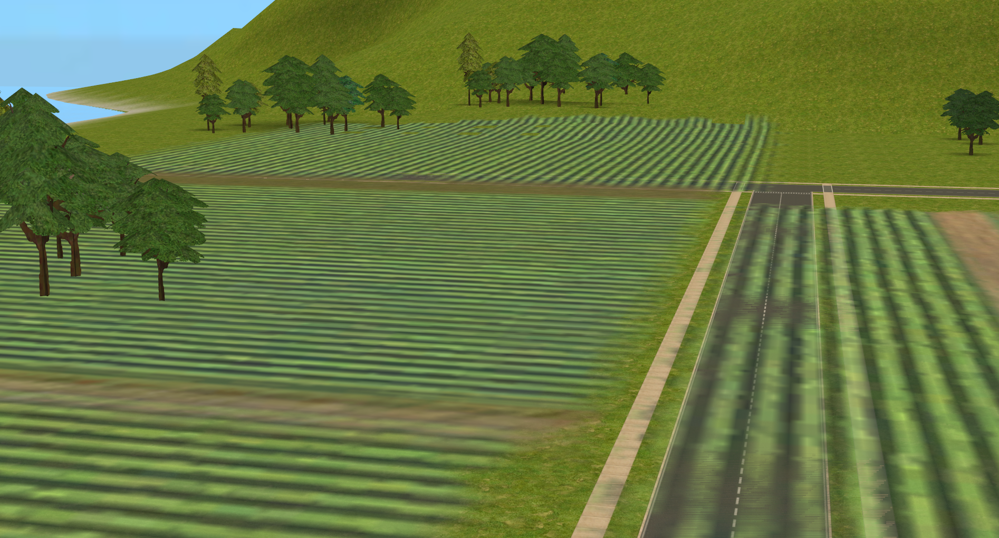
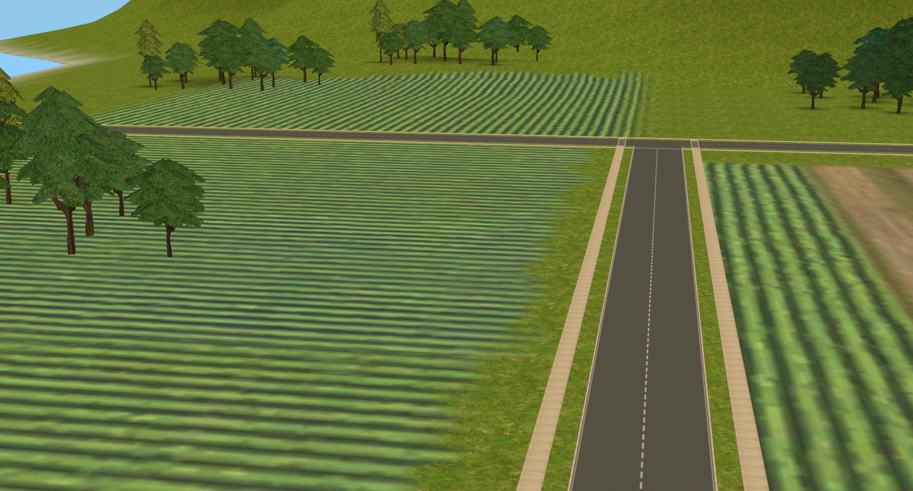

# TS2 Visible Hood FX
## About
Allows neighbourhood-exclusive details such as bridges, particle effects, and decals to appear in lot view.

| Vanilla | Mod |
| :-----: | :-: |
|  |  |

## Requirements
- The Sims 2: Ultimate Collection <ins>**OR**</ins> The Sims 2 disc version with all EPs and SPs.
- [Sims2RPC](https://modthesims.info/d/648220/sims2rpc-modded-sims-2-launcher-for-mansion-and-garden.html) <ins>**OR**</ins>
[Ultimate ASI Loader](https://github.com/ThirteenAG/Ultimate-ASI-Loader).

## Known Issues
- Decals that overlap the current lot bounds will be cut off.

Several effects require something known as an 'effect map' to be positioned correctly in the world. The lot skirt lacks this, meaning these
effects will spawn either in the sky, or directly on the current lot. To prevent this, the following effects have been blacklisted from appearing
in lot view:

- Gondolas
- Sailboats
- Birds
- Ducks
- Swans
- Ocean surfs

See the [Configuration](#configuration) section for more information on blacklisting effects.

## Installation
### <ins>Plugin</ins>
**Sims2RPC Users:**

1. Download `TS2VisibleHoodFX.zip`, found under the [Releases](https://github.com/spockthewok/TS2VisibleHoodFX/releases/latest) section of this repository.
2. Extract both the `.asi` and `.ini` files within the `Plugin` folder to your `\TSBin\mods` directory, found wherever you have the Sims 2 installed to.
For example, on my machine, they would be extracted to:

   `E:\Games\The Sims 2\Fun with Pets\SP9\TSBin\mods`

**Ultimate ASI Loader Users:**

1. Download Ultimate ASI Loader from [here](https://github.com/ThirteenAG/Ultimate-ASI-Loader/releases/download/Win32-latest/dsound-Win32.zip).
2. Extract `dsound.dll` from the zip file and place it in the game's `\TSBin` directory. On my machine, it would go here:

   `E:\Games\The Sims 2\Fun with Pets\SP9\TSBin`
3. Download `TS2VisibleHoodFX.zip`, found under the [Releases](https://github.com/spockthewok/TS2VisibleHoodFX/releases/latest) section of this repository.
4. Extract both the `.asi` and `.ini` files within the `Plugin` folder to the same `\TSBin` directory Ultimate ASI Loader was extracted to.

### <ins>Shaders</ins>
The mod also includes an edited lot skirt shader, which fixes an issue where decal effects would incorrectly draw on top of roads in lot view:

| Vanilla | Mod |
| :-----: | :-: |
|  |  |

To install, extract one of the `.package` files within the `Shaders` folder in `TS2VisibleHoodFX.zip` to your Sims 2 `\Downloads` directory. Choose the 'dreadpirate'
version if you are using [dreadpirate's shader fixes](https://www.tumblr.com/dreadpirate/179182314487/blue-snow-no-more-shader-fixes-ive-included) and ensure my
shaders load last, otherwise use the 'Maxis' version.

> [!IMPORTANT]
> You do not need to install these shaders if you are using Christaskyy's
> [Improved Shaders](https://www.tumblr.com/christaskyy/821768821608169472/ts2-improved-shaders).

## Configuration
The included `TS2VisibleHoodFX.ini` file contains all of the effects blacklisted from appearing in lot view. Effects can be blacklisted by adding them to the
config file and vice versa.

Each effect you wish to blacklist should be on a separate line &mdash; an example of the correct structure can be seen below:

```
[Blacklist]
effect1 = nhood_object1_name
effect2 = nhood_object2_name
effect3 = nhood_object3_name
```

> [!NOTE]
> The name of the neighbourhood object that creates the effect should be added to the blacklist, rather than the name of the effect itself.

The plugin falls back to a default built-in blacklist if either the config file is missing, or the config file doesn't contain the `[Blacklist]` section.
To blacklist no effects, simply remove all of the entries listed under `[Blacklist]`, like so:

```
[Blacklist]
```

For a list of all of the effects in the vanilla game, see [here](https://github.com/spockthewok/TS2VisibleHoodFX/blob/main/EFFECTS.md).

## Recommended Mods
[No Neighbourhood Effect Rocks](https://mechemik.tumblr.com/post/76558980499/hey-guys-i-bring-for-you-a-small-little-fix) by Chemic - hides the unnecessary
boulder model that certain effects place.

## Thanks
[metayeti](https://github.com/metayeti), for [mINI](https://github.com/metayeti/mINI/).

[LazyDuchess](https://github.com/LazyDuchess), for the hooking code used in this mod.

[dreadpirate](https://www.tumblr.com/dreadpirate), for their [shader fixes](https://www.tumblr.com/dreadpirate/179182314487/blue-snow-no-more-shader-fixes-ive-included).